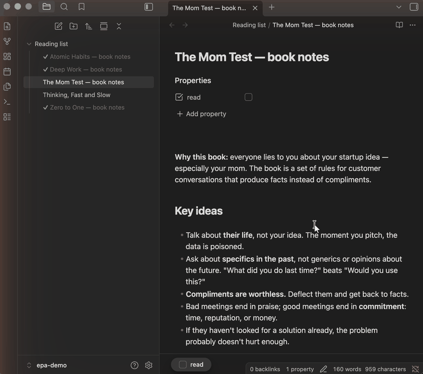

# Explorer Property Attributes

**See each note's status right in the file list — without opening anything.**

Mark a note as read, done or urgent, and the file explorer shows it instantly: gray it out, add a checkmark, a color, an emoji — whatever you choose.

And marking is one click too: an optional footer bar pins a checkbox for the property to the bottom of every note that has it, so you never scroll back to the properties panel.



## Why

Your notes already know their status — it lives in their properties (`read: true`, `status: done`, `priority: high`). But the file explorer hides all of it: every file looks the same, and you end up opening notes just to remember where you left off.

This plugin brings that information into the file explorer, and keeps it in sync the moment a property changes.

## Example: a reading tracker (the GIF above)

**1.** Give your notes a `read` property (a checkbox in the Properties panel).

**2.** In the plugin settings, set **Properties** to `read`.

**3.** Add a CSS snippet (Settings → Appearance → CSS snippets):

```css
.nav-file-title-content[data-link-read="true"] {
  color: var(--text-faint);
}

.nav-file-title-content[data-link-read="true"]::before {
  content: "✓ ";
  color: var(--color-green);
  font-weight: 700;
}
```

Click the checkbox in any note — the explorer restyles immediately.

**4.** (Optional) Also set **Note footer toggles** to `read`. Every note that has the `read` property gets a checkbox bar pinned to the bottom of its pane — finish reading, click, done. No plugins needed, no scrolling to the top.

## More ideas

- Paint `priority: high` notes red, or prefix them with 🔥
- Dim `archived: true` notes
- Give every `type: meeting` note a 📅 icon

Any property works, any value type works (list values are joined with spaces), non-ASCII property names included.

## Install

**From the community catalog:** Settings → Community plugins → Browse → search for **Explorer Property Attributes**, or use [this link](https://obsidian.md/plugins?id=explorer-property-attributes).

**Manually:** download `main.js`, `manifest.json` and `styles.css` from the [latest release](https://github.com/hemy301/explorer-property-attributes/releases/latest) into `<vault>/.obsidian/plugins/explorer-property-attributes/` and enable the plugin.

## How it works (the technical bit)

CSS alone can't see frontmatter. The plugin exposes the properties you choose as data attributes on file-explorer items — a note with `status: done` gets `data-link-status="done"` on its title element (`.nav-file-title-content`) — and your CSS snippet does the styling.

The attribute format is identical to [Supercharged Links](https://github.com/mdelobelle/obsidian_supercharged_links), so CSS snippets written for it keep working unchanged. The difference: Supercharged Links repaints the explorer only when its DOM is rebuilt (e.g. collapsing a folder), so after editing a property it can show a stale value even across an app reload — this plugin updates instantly on every metadata change, and does only this one job. If you use Supercharged Links for its other features (link styling, tab headers), both can run side by side.

The footer toggles write through Obsidian's own `processFrontMatter`, so the property is updated exactly as if you edited it in the properties panel — no custom syntax in your notes.

Only markdown files are decorated, and the plugin cleans up after itself: attributes and footers are removed when a property is removed from settings or the plugin is disabled.

## License

MIT
