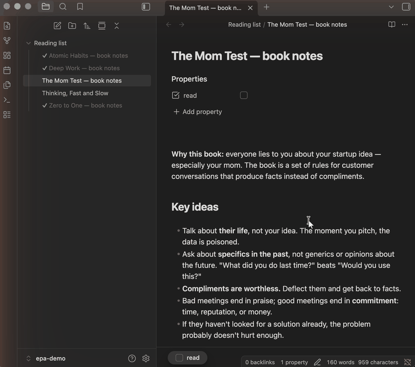

# Mark as Read

**See each note's status right in the file list — without opening anything.**



Your notes already know their status — it lives in their properties (`read: true`, `status: done`, `priority: high`) — but the file explorer hides it. This plugin shows it right there: gray out finished notes, add a checkmark, a color, an emoji. And marking is one click too: a button pinned to the bottom of every note, so you never scroll back to the properties panel.

## Quick start: a reading tracker (the GIF above)

No configuration needed — install and enable. Right away, in every note of the vault:

- a **`read` button is pinned to the bottom of the pane** (the first click creates the property in that note);
- while the property is true, the note is **grayed out with a green ✓** in the file explorer;
- finish reading, click, done — the explorer restyles instantly.

Prefer `done`, `finished`, `complete`, `archived` or `прочитано`? Use any of them in a note and the button switches to it everywhere; the list is editable in settings.

## Custom styling with CSS snippets

Every frontmatter property is also exposed as a `data-link-<name>` attribute on the note's file-explorer item, so any styling beyond the built-in graying is one CSS snippet away (Settings → Appearance → CSS snippets):

```css
/* Paint high-priority notes red and prefix them with 🔥 */
.nav-file-title-content[data-link-priority="high"] {
  color: var(--color-red);
}

.nav-file-title-content[data-link-priority="high"]::before {
  content: "🔥 ";
}
```

Any property works, any value type works (list values are joined with spaces), non-ASCII names included. The settings let you choose which properties are exposed and which get footer toggles.

## Install

**From the community catalog:** Settings → Community plugins → Browse → search for **Mark as Read**, or use [this link](https://obsidian.md/plugins?id=explorer-property-attributes).

**Manually:** download `main.js`, `manifest.json` and `styles.css` from the [latest release](https://github.com/hemy301/explorer-property-attributes/releases/latest) into `<vault>/.obsidian/plugins/explorer-property-attributes/` and enable the plugin.

## How it works (the technical bit)

CSS alone can't see frontmatter. The plugin exposes the properties you choose as data attributes on file-explorer items — a note with `status: done` gets `data-link-status="done"` on its title element — and your CSS snippet does the styling.

The attribute format is identical to [Supercharged Links](https://github.com/mdelobelle/obsidian_supercharged_links), so CSS snippets written for it keep working unchanged. The difference: Supercharged Links repaints the explorer only when its DOM is rebuilt, so it can show stale values — this plugin updates instantly on every metadata change, and does only this one job. Both can run side by side.

The footer toggles write through Obsidian's own `processFrontMatter`, so the property is updated exactly as if you edited it in the properties panel. Only markdown files are decorated, and the plugin cleans up after itself when a property is removed from settings or the plugin is disabled.

## License

MIT
